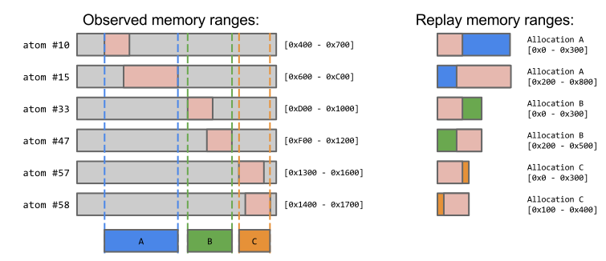

# Graphics API Server (GAPIS)

The Graphics API Server is the central component of the AGI tool suite, providing the interface between the client and the replay systems.

GAPIS has been designed to support multiple graphics APIs.
The client does not need to have any knowledge of any graphics APIs, making implementing new clients relatively trivial.


## API deep-knowledge

GAPIS uses the graphics API packages declared in [gapis/api](api) to have a deep understanding of each command in the API and how it interacts with the state.

Most of the code in these graphics API packages is generated from a corresponding graphics API file, which describes the internal state of a graphics driver, each command exposed by the API, and how each command interacts with the internal driver state. When these API files are combined with the API compiler and template files, we produce Go code that:

* Describes the classes, enums, and bitfields that are used in the graphics API. Each type declared in the API file produces a corresponding Go type via the api.go.tmpl template file.

* Describes the structure of the graphics library's State object. These are formed from the global fields in the API file.

* Describes each of the commands declared in the API. Each command in the API file produces a Go struct that implements the `api.Cmd` interface.

* Implements the `Cmd.Mutate()` method on each command, which performs the necessary mutations to the state object provided in the call.

## State mutation

The generated `Cmd.Mutate()` methods simulate the execution of the command by mutating the provided State object, and applying any memory Observations to the memory pools.

This state mutation is essential for much of the GAPIS functionality - it performs the work to get a default-initialized state to a particular point in the capture.

For example, the client can ask for a Report describing all the issues and warnings found in a capture by performing state mutation over the capture’s command list. The `Mutate()` function will log any issues it finds, and the service function keeps track of the command that raised the issue. The full collection of issues is handed back to the client in the Report structure.

The client may also ask for the state object at a particular point in the stream to display to the user. Again, GAPIS uses a default initialized State object, then calls `Mutate()` on each of the commands in turn to bring the State to the requested point in the stream, before encoding the State object and sending to the client.

Because the state mutation is so frequently used, and because captures typically contain hundreds of thousands of commands, state mutation needs to be fast in order for GAPIS to be responsive.

One of the ways GAPIS tries to reduce the amount of work needed to simulate a command is to store records of memory writes on buffers instead of allocating and copying real buffer data. Many of the commands found in a graphics API involve copying N bytes from one memory pool to another. We find that in most of the common uses of the state mutator, we may require a read of this data far less frequently than we perform copy operations.

In the rare cases we need to get at the actual binary data “written” to a particular buffer, we scan backwards through the records of the memory pool of interest, finding records that overlap the queried memory range, and applying the buffer records by copying into a real, target byte array.


## Replay

Some of the most important (and complicated) work performed by GAPIS is the building of the replay opcode stream for a capture.

Replay opcode generation also performed using the `Cmd.Mutate()` method, being handed the state object and replay Builder object.

The `Builder` contains target device memory layout information and exposes a number of high-level functions that generate a stream of `asm.Instructions`.

Each `Instruction` may result in one or more `Opcodes`, which are packaged into the payload which the replay VM executes.

Stage |                     | Description
----- | ------------------- | -----------
`1`   | `Replay()`          | `Replay()` is called on each command in the final steam, which can make a number of builder method calls.
`2`   | `Builder.foo()`     | Each builder method can produce a number of instructions.
`3`   | Instructions        | After all instructions have been generated, each instruction is processed to create a number of opcodes.
`4`   | Opcodes             | The opcodes are written directly to a byte stream in the payload.
`5`   | Payload             | And then the payload is sent to the replay system.


## Remappings

The most challenging aspect of generating a replay opcode stream is dealing with non-deterministic values and pointers. We have 3 subtly different remapping problems:

### Non-deterministic object identifier generation.

Commands like `glGenTextures` generate texture "names". The OpenGL ES specification does not state how these identifiers should be generated, so the "names" returned cannot be predicted at opcode generation time. To deal with this, we need to generate instructions to store replay- generated identifiers into a table that can be fetched for later commands that use that identifier. We call this process “*id-remapping*” and is explicitly handled on specific types.

For example, consider the following captured commands:

```
glCreateShader(GL_VERTEX_SHADER) ⇒ 5
...
glCompileShader(5)
```

The generated VM opcodes would look something like:

```
PUSH_I<s32>(GL_VERTEX_SHADER)
CALL(glCreateShader)
STORE_V<s32>(0x1234) // table address to store ID of shader 5
...
LOAD_V<s32>(0x1234)
CALL(glCompileShader)
```

### Application owned memory addresses

Application-allocated memory is often handed to the graphics driver. Commands like `glTexImage2D` has a pointer to an application-allocated buffer as the data parameter. In order to replay these commands correctly, the replay system needs to allocate chunks of memory big enough to hold the buffers, populate them with observed memory, and finally, hand allocation-relative pointers to the replay target’s driver.

In order to reduce the number of small allocations required in a replay, a pass is performed over all the commands, and all the overlapping observed memory ranges in the capture are merged into the fewest number of allocations required to encapsulate all observations. Replay pointers are then adjusted to be relative to the start address of the merged block.



### Memory Observations

Most of this logic is handled by the replay Builder via the `volatileMemoryLayout` structure.

### Driver-owned memory addresses

Some graphics API functions return pointers to graphics driver memory (for example glMapBufferRange). Unlike the pointer remappings performed for application-allocated memory, the replay system needs to remap the observed memory to addresses relative to pointers returned by the driver.

In this situation, the pointer returned by the function mapping the memory is stored to table, and when there are observations made within the “mapped” memory range, the replay logic performs a table load and then ADDs the relative offset.

For example, consider the following captured commands:

```
glMapBufferRange(GL_ARRAY_BUFFER, 0, 0x1000, GL_MAP_WRITE_BIT) ⇒ 0x400000
...
glUnmapBuffer(GL_ARRAY_BUFFER)
  Read-Observation{ Address: 0x400800, ResourceID: 0x10 }
```

The generated VM opcodes would look something like:

```
PUSH_I<s32>(GL_MAP_WRITE_BIT) // access
PUSH_I<s32>(0x1000)           // size
PUSH_I<s32>(0)                // offset
PUSH_I<s32>(GL_ARRAY_BUFFER)  // target
CALL(glMapBufferRange)
STORE_V<s32>(0x1234)  // table address to store remapped pointer 0x400000
...
LOAD_V<s32>(0x1234)
ADD<abs-ptr>(0x800)  // 0x400800 - 0x400000
RESOURCE(0x10)       // read-observation
PUSH_I<s32>(GL_ARRAY_BUFFER)
CALL(glUnmapBuffer)
```

Again, most of this logic is handled by `Builder`

### Compatibility

One of AGI's core goals is to support replays on targets different to those used to create the capture. For example, we may want to capture an OpenGL ES 2.0 application, and replay the capture using a desktop OpenGL 4.0 context.

OpenGL has the concept of core and compatibility profiles - as functions are marked as deprecated between OpenGL versions, the compatibility profile will still permit the deprecated functionality, the core profile will error. Most drivers and devices will offer compatibility profiles, but certain targets, including macOS, only supports core profiles for OpenGL 3+.

In order to support replay of older profiles on core profile devices, we need to perform command translations when building the opcodes for replay on the target device. These translations are performed by the compatibility layer.

### Unsupported commands

Our compatibility layer will compare the version of OpenGL used when taking the capture to the version of OpenGL we are building the replay for. Commands that are not supported the target’s OpenGL profile are substituted with functionally equivalent commands that are compatible with the replay device.

Take for example:

```
void glVertexAttribPointer(GLuint        index,
                           GLint         size,
                           GLenum        type,
                           GLboolean     normalized,
                           GLsizei       stride,
                           const GLvoid* pointer)
```

In OpenGL ES 2, (and OpenGL 2) the pointer argument can either be a client- side pointer to the vertex data or an offset on a `GL_ARRAY_BUFFER_BINDING`.

However, in OpenGL 4 core profile the pointer argument is always treated as an offset on a mandatory array buffer.

In this particular case, the compatibility layer will create a temporary array buffer filled with the client memory each time the vertex attribute is used.

### Texture support

Many Android devices support compression formats exposed via extensions that are only supported on particular GPUs. In order to replay captures using texture formats unsupported on the replay device, our compatibility layers can convert textures on-the-fly to formats accepted by the target hardware.

For example if the target device did not support the GL_ETC1_RGB8_OES texture format, then:

```
glCompressedTexImage2D(GL_TEXTURE_2D,       // target
                       0,                   // level
                       GL_ETC1_RGB8_OES,    // internal format
                       64, 64,              // width, height
                       0,                   // border
                       0x800,               // size
                       0x10000)             // data
```

May be substituted with:

```
glTexImage2D(GL_TEXTURE_2D,       // target
             0,                   // level
             GL_RGBA,             // internal format
             64, 64,              // width, height
             0,                   // border
             GL_RGBA,             // format
             GL_UNSIGNED_BYTE,    // type
             0x40000)             // data
```

Where decompressed texture data is stored at 0x40000.

### GLSL shader source conversion

Much like the OpenGL and OpenGL ES commands, there are many different and often subtle differences in the shader language between versions. Our compatibility layers will reformat the shader source code embedded in the capture streams to satisfy the target device.

Example transformations include:

* Replacing the `attribute` keyword with `out` for vertex shaders and in for fragment shaders.
* Replacing the `texture2D` keyword with texture`.
* Stripping `highp`, `mediump`, `lowp` precision specifiers.
* Adding or updating `#version` headers.

## Client service

GAPIS offers simultaneous connections from any number of clients. All client-server communication is performed through the [gRPC service interface](service/service.proto).

The service relies heavily on resource identifiers and paths to refer to computed data. This means the list of RPC functions is relatively small when considering the number of different queries the client can make.


## Paths

Paths are well defined set of encodable objects that can be chained to describe a reference to some object or data held by the server. The list of path object types can be found in [gapis/service/path/path.proto](service/path/path.proto).

A path is resolved using the RPC `Get()`, and the object returned is guaranteed to be the same with subsequent calls.

A path can be used in the RPC `Set()` call to change a value or object. As a path refers to an immutable object, the `Set()` RPC returns a new path to the changed data - typically this involves forking the capture.

Example paths:

To access the state after the 50th command of the capture with ID 0x1234ABCD, we’d use the path:

`Capture(0x1234ABCD).Commands[50].State`

To access the observed memory range 0x10000 to 0x20000 after the 30th command in capture with ID 0x1234ABCD, we’d use the path:

`Capture(0x1234ABCD).Commands[30].MemoryRange<0x10000-0x20000>`


## Resource Identifiers

A resource identifier is a sequence of 20 bytes, usually calculated as a SHA1 of the data it represents. Resource identifiers are used by Blob paths to access a chunk of binary data.
