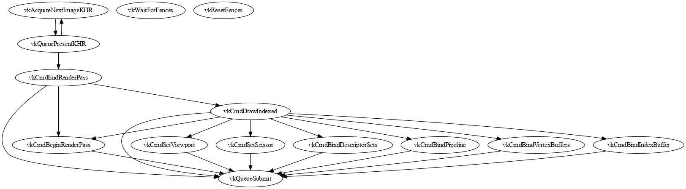

# Dependency graph

The dependency graph tracks dependencies between the commands of a capture.

> This doc is an overview of the dependency graph internals. As the code
> evolves, the few code snippets used here may not match the latest version,
> but should still help to understand the high-level approach.

In general, Command B depends on command A if command A has some side-effect to
the API state or some resource (image, buffer...) memory that impacts command B.

To take a small Vulkan example:

```
vkCmdSetScissor(...);  // Update the scissor value in Vulkan state
vkCmdDraw(...);        // Draw is affected by the scissor value
```

Here, `vkCmdSetScissor()` updates the scissor value of the associated graphics
pipeline in the Vulkan API state, then `vkCmdDraw()` performs a draw that is
impacted by this scissor value. Hence, `vkCmdDraw()` depends on
`vkCmdSetScissor()`.

The dependency graph establishes dependencies between the commands of a trace by
tracking each command's accesses to memory and the API state. It was introduced
to help with dead-code elimination (i.e. removing irrelevant commands from a
capture for a given replay), but it might be relevant to other use-cases.

## A dependency graph example

The dependency graph is meant to be used internally and not directly presented
to the end user. Still, in order to understand it, it is good to see what it
looks like some simple examples.

You can view the dependency graph of a given capture using the
`create_graph_visualization` gapit verb, e.g.:

```
./gapit create_graph_visualization -format dot -out depgraph.dot com.example.gfxtrace
```

> Warning: the dependency graph gets quickly fairly big on traces of real games,
> you might not be able to easily explore them using a DOT viewer.

The dependency graph of a trace of one frame of Sascha Willems
[triangle demo](https://github.com/SaschaWillems/Vulkan#01---triangle) looks
like this (as of October 2020):



We can see that `vkQueuePresent` has a dependency edge pointing to
`vkCmdEndRenderPass`, which reflects the fact that the render pass must be
executed before the frame is presented. Now, `vkCmdEndRenderPass` itself
transitively depends on all commands of the command buffer that was submitted,
eventually leading to `vkQueueSubmit`. Also, `vkCmdDrawIndexed` depends on the
several commands that performs all the required setup (`vkCmdBindPipeline`,
`vkCmdBindIndexBuffer`, etc), but these setup commands do not depend on each
other, as they can be performed in any order.

## Structure of the dependency graph

The `DependencyGraph` interface defines possible operations on a dependency
graph, and it is implemented by the `dependencyGraph` type.

The graph nodes are defined by the `Node` interface, which is implemented by two
kinds of nodes: `CmdNode` represents an API command or subcommand, and `ObsNode`
represents a memory observation. The graph also stores dependencies between the
nodes: these dependencies are untyped, they are just represented by an ordered
pair of node IDs, such that there is a source node and a target node.

For all nodes, the graph stores the node accesses to API state and memory in a
`NodeAccesses` type, which is retrievable via `GetNodeAccesses()`. Note that
these accesses are saved only if the `SaveNodeAccesses` field of the
`DependencyGraphConfig` object used at graph creation time is set to `true`.
There are several kinds of node accesses, the main two are `FragmentAccess`
which represent an access to a part (a "fragment") of the API state, and
`MemoryAccess` which represents an access to some memory.

## Creation of the dependency graph

The dependency graph is created by mutating all the capture commands and
monitoring their accesses to API state and memory.

### Approach overview

Let's give a high-level, conceptual illustration of this process: consider we
have a memory made of two slots, each slot being an addressable part of the
memory. When building the dependency graph, for each slot we remember the ID of
the node that was the latest to write to this memory. Say during mutation we are
at a point where the latest node to write to slot 1 was node 11, and the latest
to write to slot 2 was 22:

```
slot1: 11
slot2: 22
```

Now, we mutate the next command whose CmdNode ID is 33. This command reads
from slot1, and read-writes to slot2. Since it reads from both slots, it depends
on both node 11 and 22. As it writes to slot2, at the end of the command
mutation, the memory accesses tracker is updated to:

```
slot1: 11
slot2: 33
```

This makes sure that the next command to read from slot2 will depend on 33.

Now, a single command may have multiple read/write to the same slot: we should
not update the memory access tracker as soon as there is a write, otherwise a
subsequent read by the same command would create a circular dependency to the
node itself. To avoid this, all read/writes of a single command are temporarily
stored in a list of *pending* accesses, which are *flushed* (see the various
`Flush()` functions) when the command ends.

### In practice

In practice, in `BuildDependencyGraph()`, a `dependencyGraphBuilder` is created
and passed as the `api.StateWatcher` to each command's `Mutate()`. The
`api.StateWatcher` interface lists callbacks that are invoked during mutation,
including when a command or subcommand starts or ends, and whenever it does an
API state access (`OnReadFrag()`/`OnWriteFrag()`) or a memory access
(`OnReadSlice()`/`OnWriteSlice()` and `OnReadObs()`/`OnWriteObs()`).

The `dependencyGraphBuilder` builder object contains itself some dedicated
sub-watchers like a `FragWatcher` and a `MemWatcher`, which focus on API state
and memory, respectively. These watcher accumulate pending accesses of a command
and its potential subcommands (so there can be several nodes pending), and
dependencies are established when a top-level command ends: `OnEndCmd()` calls
`AddDependencies()` that calls `AddNodeDependencies()` on each pending node.

The tracking of API state fragment and memory accesses is done in an
API-agnostic way, there is no direct correlation with e.g. Vulkan state or
objects. This tracking is also more complex than the simplified memory slots
used to illustrate the approach. Basically, a memory access is defined by an
`interval.U64Span` within a given `memory.PoolID`, and an API state fragment
access is defined by some `api.RefID` and `api.Fragment`. In both cases, the
high-level approach presented above applies.

### Forward dependencies

Forward dependencies are a special kind of dependency that applies to API
commands that come in pairs. For instance, `vkBeginCommandBuffer()` and
`vkEndCommandBuffer()` come in pairs: if you have one, you should have the
other.

In practice, alongside the `FragWatcher` and the `MemWatcher`, the dependency
graph buidler also has a `ForwardWatcher` which handles forward dependencies via
three callbacks: `OpenForwardDependency()`, `CloseForwardDependency()` and
`DropForwardDependency()`.

Most forward dependencies are only concerned with open and close operations. For
instance, the mutation of `vkBeginCommandBuffer()` triggers
`OpenForwardDependency()` that creates an open forward dependency, and
`vkEndCommandBuffer()` triggers `CloseForwardDependency()` that closes it,
marking the dependency between these two commands. Open and close are matched on
a `dependencyID` that, as empty interface, could be anything. In the case of
`vkBegin/EndCommandBuffer`, the command buffer Vulkan handle is used as a
`dependencyID`. Other kinds of command pairs are the `vkCreate*()` and
`vkDestroy*()` ones.

`DropForwardDependency()` is handy for Vulkan fences: the signal and wait
operations of a fence usually come in pairs, but a `vkResetFences()` can also
unsignal fences. In this case, mutation of `vkResetFences()` triggers a
`DropForwardDependency()` on all relevant fences, to mark that the fence
resetting disallows a signal/wait dependency, without depending itself on
previous signal operations.
